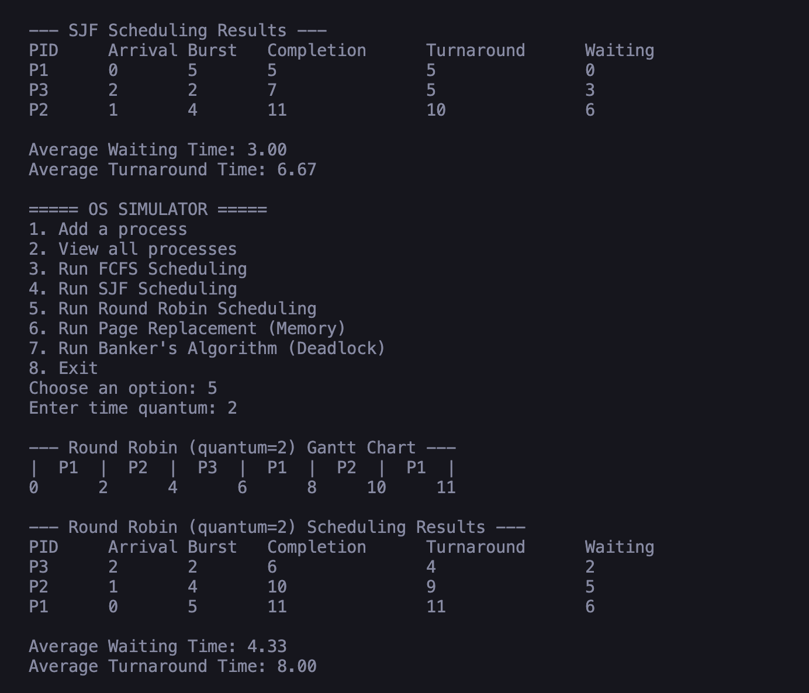
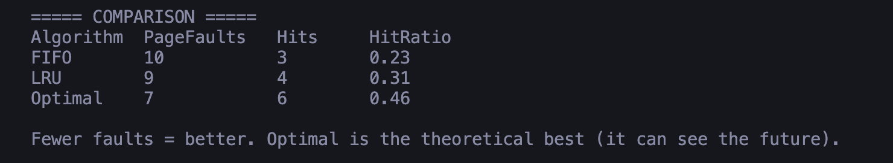
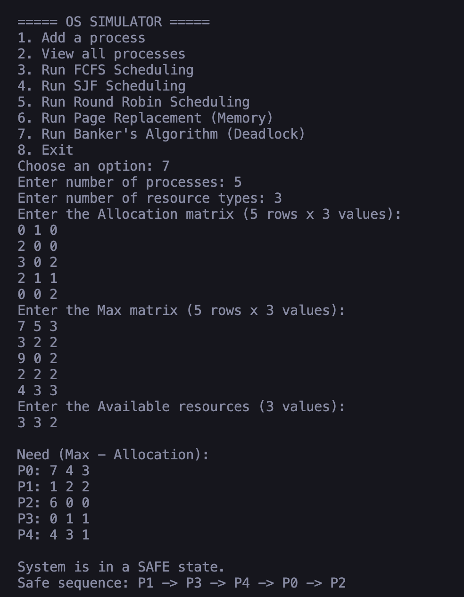

# OS Simulator

A console-based operating system simulator written in pure Java. It models the core decisions a real operating system makes — **CPU scheduling**, **memory page replacement**, and **deadlock avoidance** — and prints step-by-step results so the behaviour of each algorithm is visible, not hidden.

This project was built to serve two purposes at once: as a hands-on way to learn operating-system internals by implementing them, and as a portfolio piece demonstrating understanding of CS fundamentals rather than just application code.

📄 **[Full walkthrough with sample output (PDF)](OS_Simulator_Walkthrough.pdf)** — the program running end to end, section by section.

---

## What it does

The simulator does not run a real operating system. Instead, it recreates the _algorithms_ an OS uses to manage a computer's limited resources. You feed in processes or resource data through a menu, pick an algorithm, and the program shows exactly what the OS would decide and why.

It covers three classic operating-system topics:

1. **CPU Scheduling** — deciding which process runs next
2. **Memory Management** — deciding which memory page to evict when memory is full
3. **Deadlock Avoidance** — deciding whether granting resources is safe

---

## Features

### 1. CPU Scheduling

Three scheduling algorithms, each printing a Gantt chart and a results table with completion time, turnaround time, waiting time, and averages.

- **FCFS (First Come First Serve)** — non-preemptive; processes run in arrival order.
- **SJF (Shortest Job First)** — non-preemptive; the shortest available job runs next.
- **Round Robin** — preemptive; each process runs for a fixed time quantum, then yields the CPU to the next.

### 2. Memory Management — Page Replacement

Runs all three algorithms on the _same_ reference string and compares them side by side (page faults, hits, and hit ratio).

- **FIFO** — evict the oldest page in memory.
- **LRU (Least Recently Used)** — evict the page unused for the longest time.
- **Optimal** — evict the page not needed for the longest time in the future (theoretical benchmark).

### 3. Deadlock Avoidance — Banker's Algorithm

Given allocation, maximum, and available resource data, it computes the Need matrix, checks whether the system is in a **safe state**, and prints a **safe sequence** if one exists.

---

## Technologies

- **Java (JDK 21)** — standard library only, no external dependencies
- **Git** — version control

---

## Project Structure

| File                 | Responsibility                                                     |
| -------------------- | ------------------------------------------------------------------ |
| `OSSimulator.java`   | Menu-driven driver; collects user input and calls the right module |
| `Process.java`       | Data model for a single process                                    |
| `CPUScheduler.java`  | FCFS, SJF, Round Robin + Gantt chart                               |
| `MemoryManager.java` | FIFO, LRU, Optimal page replacement + comparison                   |
| `Banker.java`        | Banker's Algorithm safety check                                    |

---

## How to Run

```bash
# Compile all source files
javac *.java

# Run the simulator
java OSSimulator
```

Then choose an option from the menu and follow the prompts.

---

## Sample Runs

### Round Robin Scheduling (time quantum = 2)

Input processes:

| PID | Arrival | Burst |
| --- | ------- | ----- |
| P1  | 0       | 5     |
| P2  | 1       | 4     |
| P3  | 2       | 2     |

Output:

```
--- Round Robin (quantum=2) Gantt Chart ---
|  P1  |  P2  |  P3  |  P1  |  P2  |  P1  |
0      2      4      6      8     10     11

PID  Arrival  Burst  Completion  Turnaround  Waiting
P3   2        2      6           4           2
P2   1        4      10          9           5
P1   0        5      11          11          6

Average Waiting Time: 4.33
Average Turnaround Time: 8.00
```

### Page Replacement (3 frames)

Reference string: `7 0 1 2 0 3 0 4 2 3 0 3 2`

```
===== COMPARISON =====
Algorithm  PageFaults   Hits   HitRatio
FIFO       10           3      0.23
LRU        9            4      0.31
Optimal    7            6      0.46
```

Optimal produces the fewest faults (it can see future requests), LRU is the realistic middle ground, and FIFO is the simplest but least efficient.

### Banker's Algorithm (5 processes, 3 resource types)

```
Need (Max - Allocation):
P0: 7 4 3
P1: 1 2 2
P2: 6 0 0
P3: 0 1 1
P4: 4 3 1

System is in a SAFE state.
Safe sequence: P1 -> P3 -> P4 -> P0 -> P2
```

---

## Screenshots

Output captured directly from the running simulator.

### Round Robin Gantt Chart



### Page Replacement Comparison (FIFO vs LRU vs Optimal)



### Banker's Algorithm Safe Sequence



---

## Concepts Demonstrated

- Process scheduling and the trade-offs between fairness (Round Robin) and efficiency (SJF)
- The convoy effect in FCFS and starvation risk in SJF
- Page replacement strategies and how lookahead (Optimal) sets the performance ceiling
- Deadlock avoidance through safe-state detection

---

## Possible Future Extensions

- Preemptive SJF (Shortest Remaining Time First) and Priority scheduling
- Resource-request handling in Banker's Algorithm (grant/deny a specific request)
- Saving and loading process sets from a file
